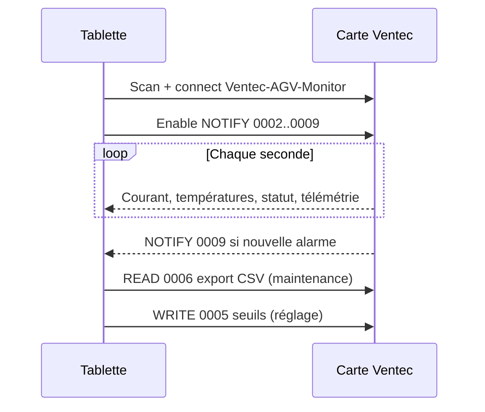

# Ventec BLE API — Client tablette

SDK de référence pour connecter l’application technicien Ventec à la carte AGV Monitor.

## Contenu

| Fichier | Rôle |
|---------|------|
| `PROTOCOL.md` | Spécification GATT complète (octets, UUID, flags) |
| `android/VentecBleUuids.kt` | UUIDs à copier dans le projet Android |
| `android/VentecBleParser.kt` | Parse des payloads NOTIFY / READ |
| **`android-app/`** | **App Android minimale** (scan + écran live technicien) |

## App tablette prête à lancer

Voir [`android-app/README.md`](android-app/README.md) — ouvrir le dossier dans Android Studio, installer sur tablette, scanner `Ventec-AGV-Monitor`.

## Intégration Android (Kotlin)

1. Copier `android/*.kt` dans le module app (`com.ventec.ble`).
2. Ajouter les permissions BLE dans `AndroidManifest.xml`.
3. Utiliser `BluetoothGatt` ou **Nordic Android BLE Library** pour connecter.
4. S’abonner aux NOTIFY listés dans `VentecBleUuids.NOTIFY_CHARACTERISTICS`.
5. Passer les octets reçus à `VentecBleParser`.

Exemple minimal :

```kotlin
val parser = VentecBleParser()
gatt.getService(VentecBleUuids.SERVICE)?.getCharacteristic(VentecBleUuids.CHAR_CURRENT)?.let { char ->
    // activer CCCD puis dans onCharacteristicChanged :
    parser.parseCurrent(value)?.let { amps -> updateUi(amps) }
}
```

## Flux recommandé UI technicien



## Firmware associé

Implémentation carte : `src/ble_service.cpp` (firmware v1.3+).
